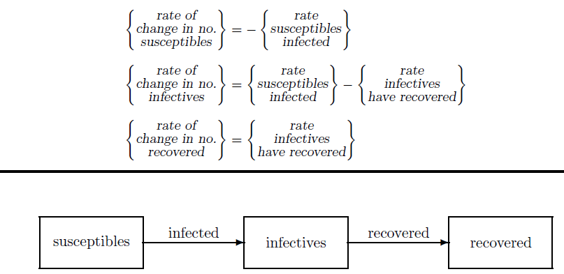

# Introduction
In this project, we aim to examine infectious diseases and how they spread. To achieve this, we represent the population of those at risk of contracting the disease, or those who are susceptible to infection from a contaminated environment, with $S(t)$, and those who have contracted the disease with $I(t)$. By considering appropriate assumptions and some simplifications, we solve the problem.
This project consists of two parts:
1.	Solving the equations using MATLAB and modeling the population without considering natural deaths and births.
2.	Modeling and solving using MATLAB while taking into account the population change rate due to births and natural deaths.

In each of these scenarios, we examine a sample problem with given initial conditions.

## Assumptions Necessary for Deriving Equations
In this project, we consider two different scenarios to derive the relevant formulas and equations, each based on a set of assumptions. In the first scenario, we do not account for population changes due to natural births and deaths, while in the second scenario, we include these factors.
### Assumptions:
1.	The population of infected individuals and those at risk is sufficiently large.
2.	Births and natural deaths are ignored; the disease spreads solely through contact.
3.	The incubation period, during which an infected individual is unaware but can still transmit the disease, is considered negligible (zero).
4.	All individuals who recover from the disease are assumed to gain complete immunity, meaning they cannot contract the disease again.
5.	The population of healthy and infected individuals is homogeneously mixed.

### Diagram for Population Change Rate and Modeling:

Based on the above assumptions, we construct the following diagrams:

# Modeling:
If we assume the entire healthy population starts with a single infected individual, then as the number of healthy individuals (denoted by ${I(t)}$) increases, the number of new infections also increases. This is proportional to the number of healthy individuals, with a proportionality constant $\beta$ (transmission rate). Thus, the number of new infections from all infected individuals is equal to:

