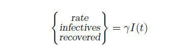

# Introduction
In this project, we aim to examine infectious diseases and how they spread. To achieve this, we represent the population of those at risk of contracting the disease, or those who are susceptible to infection from a contaminated environment, with $S(t)$, and those who have contracted the disease with $I(t)$. By considering appropriate assumptions and some simplifications, we solve the problem.
This project consists of two parts:
1.	Solving the equations using MATLAB and modeling the population without considering natural deaths and births.
2.	Modeling and solving using MATLAB while taking into account the population change rate due to births and natural deaths.

In each of these scenarios, we examine a sample problem with given initial conditions.

## Assumptions Necessary for Deriving Equations
In this project, we consider two different scenarios to derive the relevant formulas and equations, each based on a set of assumptions. In the first scenario, we do not account for population changes due to natural births and deaths, while in the second scenario, we include these factors.
### Assumptions:
1.	The population of infected individuals and those at risk is sufficiently large.
2.	Births and natural deaths are ignored; the disease spreads solely through contact.
3.	The incubation period, during which an infected individual is unaware but can still transmit the disease, is considered negligible (zero).
4.	All individuals who recover from the disease are assumed to gain complete immunity, meaning they cannot contract the disease again.
5.	The population of healthy and infected individuals is homogeneously mixed.

### Diagram for Population Change Rate and Modeling:

Based on the above assumptions, we construct the following diagrams:

# Modeling:
If we assume the entire healthy population starts with a single infected individual, then as the number of healthy individuals (denoted by ${I(t)}$) increases, the number of new infections also increases. This is proportional to the number of healthy individuals, with a proportionality constant $\beta$ (transmission rate). Thus, the number of new infections from all infected individuals is equal to:

### Removing Individuals from the System:
There are three categories of individuals removed from the system:
1.	Individuals who recover.
2.	Individuals who die from the disease.
3.	Individuals who are quarantined.
Similar to the previous step, the number of individuals who recover is proportional to the number of infected individuals, with $\gamma$ as the recovery rate.
### Equation for Recovery Rate:  
](https://github.com/hamidnakhaei/infectious_diseases_population_dynamics/blob/898a7a302e96823705d31c8ed8d57759c36a0ad5/Figures/3.png)

### Modeling and Formulation:
Based on the above assumptions, we are ready to formulate the problem. The formulation is as follows:

### Initial Conditions:
$$S(0) = s_0 , \qquad  I(0)=i_0, \qquad  R(0)=0$$
Where $R(t)$ represents the number of recovered individuals over time. \
Using these initial conditions, we can solve the differential equations to model the spread of the infectious disease under the given assumptions.

# Solving Equations Using MATLAB
To solve the above system of differential equations in MATLAB, we use the `ode45` function. In the main function, we use the `option` parameter to set the precision for solving the equations. We then specify the time interval for which we want to find the solution and input the initial conditions, as shown in the following figure: \
 \
In the function defined separately for `ode45`, we assign ${I(t)}$ to $y(1)$ and $S(t)$ to $y(2)$. Thus, we have $dI/dt = dy(1)$ and $dS/dt=dy(2)$. This step is essential for transforming the differential equations into a format that MATLAB can understand. The equations must be expressed such that one side contains the derivatives $dy(n)$, and the other side contains the non-derivative functions $y(n)$. As illustrated in the MATLAB code for `ode45`:\
 \
This function solves the equations with the defined precision over very small intervals and stores the results as column vectors or matrices in $y(1)$ and $y(2)$, which correspond to $S(t)$ and $I(t)$ respectively. For plotting the graphs, we use the `plot` function. As previously mentioned, `ode45` stores the solutions as a column matrix, which is used along with the time matrix for plotting.
# Example Problem and Analysis
